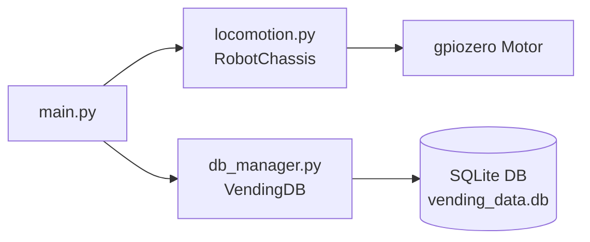
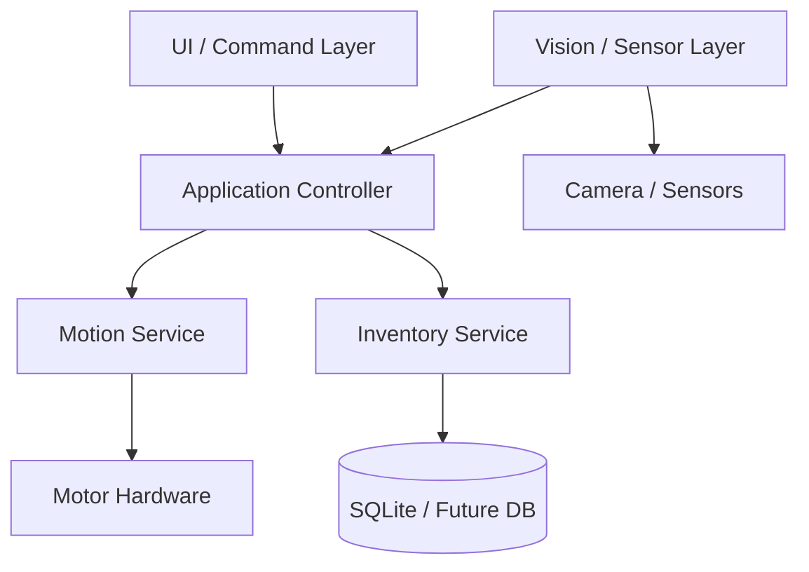

# Robot OS System Design

## 1. Purpose

This codebase is a small robot control system centered on two implemented capabilities:

1. Motion control through GPIO motor drivers.
2. Inventory management through a local SQLite database.

The current entrypoint starts the robot, drives it forward for a short interval, stops motion, and then prints the current inventory.

## 2. Current Architecture

### Runtime flow

1. `main.py` creates a `RobotChassis` instance.
2. `main.py` creates a `VendingDB` instance.
3. The robot moves forward for a short period.
4. Motion is stopped.
5. Inventory data is read from SQLite and printed.

## 3. Module Responsibilities

### `main.py`

The orchestration layer. It coordinates hardware initialization and a simple example scenario. Right now it is the only file that connects the motion and database subsystems.

### `locomotion.py`

Contains `RobotChassis`, which owns the motor control API:

- `move_forward()`
- `move_backward()`
- `turn_left()`
- `turn_right()`
- `stop()`

This module depends on `gpiozero` and directly maps software calls to GPIO pin control.

### `db_manager.py`

Contains `VendingDB`, which owns local persistence:

- database initialization
- upsert of inventory items
- stock decrement for dispensing
- inventory retrieval

This module uses SQLite and is the data source for the inventory view.

### `ui_engine.py`

Currently empty. This is the natural place for a touchscreen or CLI UI layer that would:

- show inventory
- trigger dispense actions
- provide movement controls or status

### `vision_core.py`

Currently empty. This is the natural place for camera or object-detection logic that would:

- detect a user or item
- validate item selection
- provide navigation or safety checks

## 4. Suggested Target Design

If you want this project to grow into a complete vending or service robot, a clean next-step architecture is:

### Recommended boundaries

- UI handles user interaction only.
- Application Controller coordinates actions and enforces rules.
- Motion Service owns hardware movement and safety stop logic.
- Inventory Service owns stock updates and purchase rules.
- Vision Service owns camera input and detection.
- Persistence stays isolated behind the database layer.

## 5. Key Design Decisions

- Keep hardware access isolated in `locomotion.py` so it can be tested or mocked separately.
- Keep SQLite access isolated in `db_manager.py` so inventory logic does not leak into the UI or motion code.
- Treat `main.py` as a thin bootstrapper rather than a place for business logic.
- Add `ui_engine.py` and `vision_core.py` only after their APIs are defined, so they do not become tightly coupled to hardware details.

## 6. Risks And Gaps

- `ui_engine.py` and `vision_core.py` are not implemented yet.
- There is no explicit application service layer between hardware, UI, and persistence.
- Database access opens and closes a new SQLite connection on each call, which is fine for a small prototype but may need refactoring later.
- There is no shared error-handling strategy for hardware failures, database failures, or emergency stop cases.

## 7. Next Implementation Steps

1. Define a controller layer that coordinates UI, motion, and inventory.
2. Implement the UI module to expose inventory and action controls.
3. Add a vision module if camera-based automation is required.
4. Introduce unified error handling and logging.
5. Add a startup/config module for GPIO pins, database path, and operating modes.
